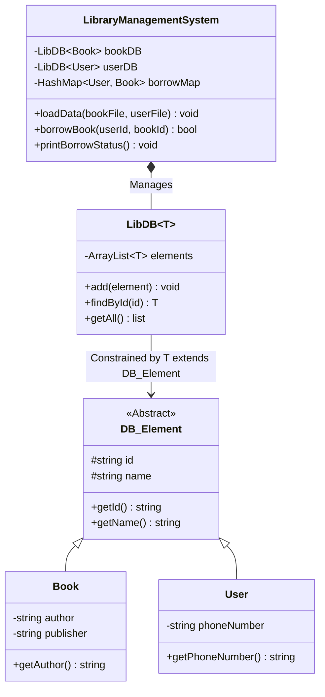

# Library Management System | Java 제네릭 기반 도서 대출 관리 시스템

> 객체지향 프로그래밍(OOP) 핵심 원칙인 추상화, 제네릭 바운딩, 컬렉션 프레임워크를 적용하여 파일 기반 도서·회원 데이터를 로드하고 인메모리 대출 트랜잭션을 처리하는 Java 콘솔 애플리케이션

---

[시스템 개요 및 빠른 시작](#1-프로젝트-개요-project-overview)
- [객체지향 설계 가치 (OOP Core & Validation)](#2-객체지향-설계-가치-oop-core--validation)
- [코어 대출 파이프라인 및 상태 전이](#3-코어-대출-파이프라인-및-상태-전이-core-pipeline--mechanics)
- [도메인 모델 및 클래스 아키텍처](#4-도메인-모델-및-클래스-아키텍처-technical-architecture)
- [소스 코드 구현 명세](#5-소스-코드-구현-명세-core-architecture--implementation)
- [핵심 테크니컬 하이라이트](#6-핵심-테크니컬-하이라이트-technical-highlights)
- [빌드 및 실행 가이드](#7-빌드-및-실행-가이드-system-requirements)

---

### 1. 프로젝트 개요 (Project Overview)

* **도메인 / 분야:** 객체지향 프로그래밍(OOP) · 자료구조 및 컬렉션(Collections) · 도서 대출 관리
* **플랫폼 / CLI:** Java Standard Edition (SE) 콘솔 애플리케이션 / BlueJ IDE 호환
* **개발 체제:** 학부 객체지향 설계 팀 실습 프로젝트
* **핵심 기술 스택:** `Java 11+` · `Generics (Bounded Type)` · `HashMap / ArrayList` · `File I/O`

---

### 2. 객체지향 설계 가치 (OOP Core & Validation)

* **USP-1. 제네릭 바운디드 타입 기반 공통 엔티티 저장소 (`LibDB<T extends DB_Element>`)**
  * `Book`, `User` 등 개별 엔티티마다 중복 저장소를 작성하지 않고, 상한 경계 제네릭(`<T extends DB_Element>`)을 활용하여 단일 제네릭 컬렉션으로 저장 및 검색을 캡슐화.
* **USP-2. 인메모리 대출 매핑 및 파일 I/O 파이프라인**
  * 텍스트 파일(`BookData2025.txt`, `UserData2025.txt`)을 토큰 단위로 파싱하여 런타임 인메모리 객체로 인스턴스화하고 대출 관계를 `HashMap`으로 관리.
* **USP-3. 단계적 리팩토링 및 다권 대출 확장 경로 확보**
  * 기본 1인 1권 대출 구조에서 다권 대출 및 복합 유효성 검증으로의 확장([teammodule-1-v2](https://github.com/kara320090/teammodule-1-v2))이 가능하도록 인터페이스 기반 분리.

---

### 3. 코어 대출 파이프라인 및 상태 전이 (Core Pipeline & Mechanics)

```text
[BookData.txt / UserData.txt]
              │
              ▼
┌────────────────────────────────────────────────────────┐
│ 1. File Ingestion Engine (LibraryManagementSystem)     │
│ - 텍스트 파일 파싱 및 유효성 검증                      │
└──────────────────────────┬─────────────────────────────┘
                           │
                           ▼
┌────────────────────────────────────────────────────────┐
│ 2. In-Memory Database Ingestion                        │
│ - LibDB<Book> & LibDB<User> 제네릭 저장소 적재         │
└──────────────────────────┬─────────────────────────────┘
                           │
                           ▼
┌────────────────────────────────────────────────────────┐
│ 3. Borrow Transaction Execution                        │
│ - borrowBook(User, Book) -> HashMap<User, Book> 갱신   │
└────────────────────────────────────────────────────────┘
```

---

### 4. 도메인 모델 및 클래스 아키텍처 (Technical Architecture)



---

### 5. 소스 코드 구현 명세 (Core Architecture & Implementation)

```
2025team/
├── App.java                           # 실행 진입점(main) 및 데모 대출 시나리오 수행
├── LibraryManagementSystem.java       # 도서·회원 파일 로더 및 대출 트랜잭션 오케스트레이터
├── DataBase/
│   └── LibDB.java                     # 제네릭 바운디드 컬렉션 저장소 클래스 (T extends DB_Element)
├── myClass/
│   ├── DB_Element.java                # 공통 식별 속성을 정의한 베이스 추상 클래스
│   ├── Book.java                      # 도서 도메인 모델 (ISBN/ID, 제목, 저자)
│   └── User.java                      # 회원 도메인 모델 (회원ID, 성명, 연락처)
├── BookData2025.txt                   # 도서 초기 적재용 텍스트 데이터셋
└── UserData2025.txt                   # 회원 초기 적재용 텍스트 데이터셋
```

---

### 6. 핵심 테크니컬 하이라이트 (Technical Highlights)

| 구분 | 적용 기술 및 설계 패턴 | 구현 효과 및 엔지니어링 의사결정 이유 |
| :--- | :--- | :--- |
| **제네릭 바운딩** | `<T extends DB_Element>` | 컴파일 타임 타입 안정성을 확보하고 캐스팅 예외(`ClassCastException`)를 원천 차단 |
| **인메모리 해싱** | `HashMap<User, Book>` 매핑 | O(1) 시간 복잡도로 회원의 대출 상태를 조회하고 빠른 대출 처리 구현 |
| **단일 책임 원칙** | 데이터 저장(DB)과 비즈니스 로직 분리 | `LibDB`는 컬렉션 조작만 담당하고 `LibraryManagementSystem`에서 트랜잭션 흐름을 관장 |

---

### 7. 빌드 및 실행 가이드 (System Requirements)

#### 요구 사양
* **Java SDK:** OpenJDK 또는 Oracle JDK 8 이상 (JDK 11+ 권장)
* **IDE 지원:** BlueJ, IntelliJ IDEA, Eclipse 또는 커맨드라인 CLI

#### 빠른 시작 (CLI 실행)
```powershell
# 1. 소스 컴파일 (UTF-8 인코딩)
javac -encoding UTF-8 -d out App.java LibraryManagementSystem.java DataBase/LibDB.java myClass/Book.java myClass/User.java myClass/DB_Element.java

# 2. 애플리케이션 구동
java -cp out App
```
